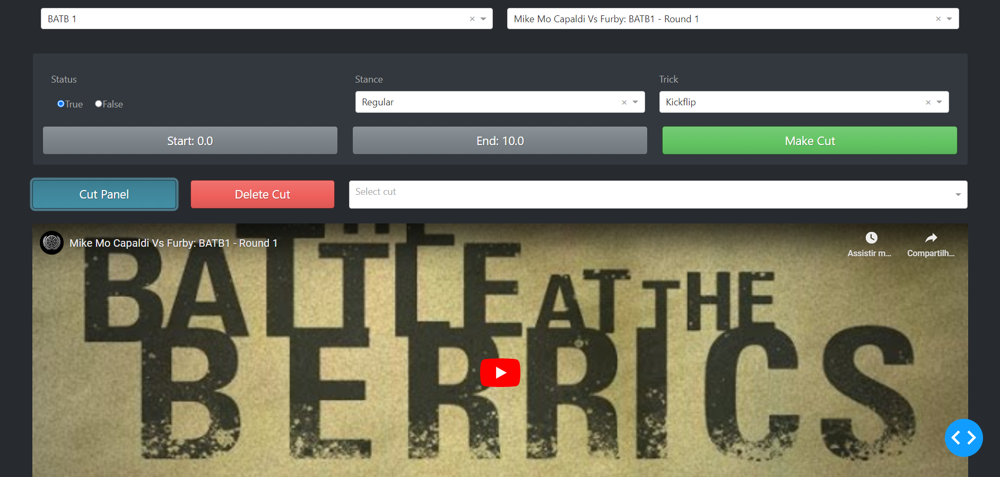

# SkateAI


Welcome to SkateAI, an in-progress project that aims to predict skateboard flatground tricks based on videos taken from the famous Battle at the Berrics (BATB).

> This README file was generate with the help of [ChatGPT](https://chat.openai.com/chat)
## Next steps
- [x] Create a Labelling tool
- [x] Have a working training loop
- [ ] Add video avg brightness and other things to metadata
- [ ] Add Dropout to the Heads module
- [ ] Label 1k clips
- [ ] Create a check performance for validation
- [ ] Create split script for train-validation
- [ ] Integrate training loop with Weights & Biases (not sure what to log)
- [ ] Do a sweep with W&B


## Overview

SkateAI is a deep learning based model trained on a dataset of BATB videos that allows users to input a video of a skateboarder attempting a flatground trick, and the model will output a prediction of which trick the skateboarder is attempting. The model has been trained to recognize a variety of flatground tricks, such as kickflips, shuvit variations, and more.

## Reproducibility

If you want to give it a try feel free to star, clone or fork the repo. To clone do:

```bash
git clone https://github.com/EduardoPach/SkateAI.git
```

You can install the dependencies with pip or pipenv depending on how you're managing your venv with one of the following:

```bash
pip install -r requirements.txt # if you are managing your own venv
pipenv install . # To install only the necessary dependencies
pipenv install --dev # To install all dependencies including dev ones
```

For this project I created my own humble labelling tool with the `dash` library. To use the tool run:

```bash
python ./labeling_tool/index.py

>>> Dash is running on http://127.0.0.1:8050/
```



It's configured in the `./labelling_tool/const.py` (yeah, I'm lazy for using a .py) and uses as sources some playlists from [the Berrics youtube channel](https://www.youtube.com/@berrics/featured). In the tool cuts are created and stored in the `./data/tricks_cut.json` like: 

```json
{
    "https://www.youtube.com/watch?v=sDLIf7JVNnM": {
        "regular treflip landed 1": {
            "interval": [
                149.6,
                151.9
            ],
            "video_source": "BATB 11",
            "trick_info": {
                "body_rotation_type": "none",
                "body_rotation_number": 0,
                "board_rotation_type": "backside",
                "board_rotation_number": 2,
                "flip_type": "kickflip",
                "flip_number": 1,
                "landed": true,
                "stance": "regular",
                "trick_name": "treflip"
            }
        }
}

```

Where the keys are the main video links and the values are cuts associated with the video. The main fields are:

- interval: Start and end time in seconds in the main video of the clip that was created
- trick_info: A dictionary contaning the trick information breaking it down to its main constituents
  - body_rotation_type: Backside, frontside or None
  - body_rotation_number: Arbitrary integer that represents the number of times the body rotate 180 degrees
  - board_rotation_type: Backside, frontside or None
  - board_rotation_number: Arbitrary integer that represents the number of times the board rotate 180 degrees
  - flip_type: Kickflip, heelflip or None
  - flip_number: Arbitrary integer that represents a full flipping rotation
  - stance: Feet positioning of the skateboarder. Regular, fakie, nollie, switch
  - landed: Whether or not the trick was landed
  - trick_name: How the combination of these constituents are called in the Skate jargon


To download the video clips present in the `./data/tricks_cut.json` run:

```bash
python ./labelling_tool/generate_data.py --download-all
```

The `--download-all` flag will download all cuts in the `.json` file, regardless if the video was previously downloaded, and recreate the metadata `.csv` (If you just want to download new cuts don't use this flag).

During download two new directories are generated in the `data` directory:
- videos: Where the `.mp4` files are stored.
- metadata: Where a `.csv` file with metadata about each clip downloaded.

In the `dataset` directory you'll find the implementation of a custom `torch` Dataset called `TricksDataset` and in the `models` directory you may find some usefull implementations in case you want to try your own models! 

## Usage (IN-PROGRESS)

To use SkateAI, you will need to provide a video of a skateboarder attempting a flatground trick. The video should be in a format that can be read by the model (e.g. MP4). Simply input the video into the model, and it will output a prediction of which trick the skateboarder is attempting.

## Limitations

SkateAI is designed to recognize flatground tricks only. It may not be able to accurately predict tricks that involve more complex movements or transitions, such as grinds or ramp tricks. Additionally, the model's predictions may not be 100% accurate, as there may be variations in how different skateboarders perform the same trick and the recording conditions.

## Future Work

I'm continuously working to improve the performance of SkateAI and expand its capabilities. In the future, we hope to add the ability to recognize a wider range of tricks and improve the model's accuracy. We also plan to expand the dataset to include a greater diversity of skateboarders and tricks.

## Credits

SkateAI was developed by Eduardo Pacheco. I would like to thank the skateboarding community, the creators of the BATB series, **Steve Berra** and **Eric Koston**, and the people that recorded the battles (one that I can name is **Chase Gabor**) for their contributions to this project.

I might add a list in here to thank everyone directly or indirectly related to the BATB videos.

